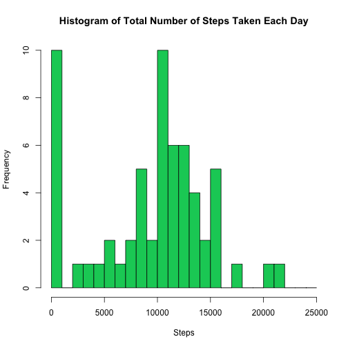
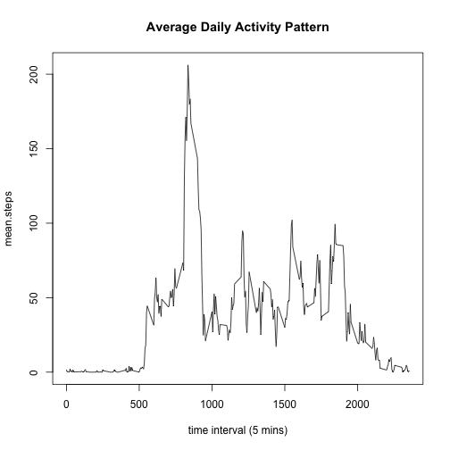
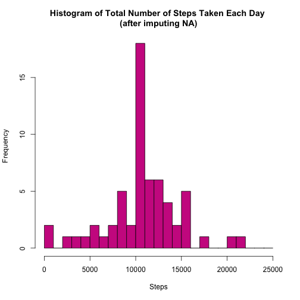
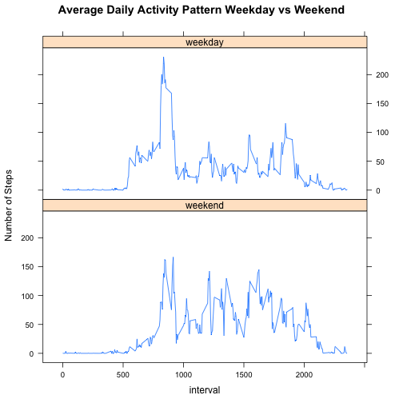

## Loading and preprocessing the data

```r
# load the activity data
activity <- read.csv(file = "./activity.csv", header = TRUE, stringsAsFactors = FALSE)
# transform a bit
activity <- transform(activity, date = as.Date(date, "%Y-%m-%d"))
```

## What is mean total number of steps taken per day?

```r
# calculate the total number of steps taken per day.
# ignore (or filter out) NA values.
agg_steps_by_date <- aggregate(activity$steps, by = list(date = activity$date), 
    FUN = function(x) { res <- sum(x, na.rm = TRUE) })

# make a histogram of the total number of steps taken each day
hist(agg_steps_by_date$x, breaks = seq(0, 25000, 1000), 
    col = "springgreen3",
    main = "Histogram of Total Number of Steps Taken Each Day",
    xlab = "Steps"
    )
```

 

```r
# calculate the mean of the total number of steps taken each day
mean_step_counts <- mean(agg_steps_by_date$x, na.rm = TRUE)
mean_step_counts <- as.character(mean_step_counts)

# calculate the median of the total number of steps taken each day
median_step_counts <- median(agg_steps_by_date$x, na.rm = TRUE)
```
* The mean of the total number of steps taken per day is 9354.22950819672 steps.  
* The median of the total number of steps taken per day is 10395 steps.  


## What is the average daily activity pattern?

```r
# calculate the mean step count values per 5 min interval for all days.
mean_steps_by_interval <- aggregate(activity$steps, 
    by = list(interval = activity$interval), function(x) { res <- mean(x, na.rm = TRUE) })

# rename the column just to tidy up the data set
names(mean_steps_by_interval)[2] = c("mean.steps")

# calculate the max mean step counts during 5-minute interval
max_mean_step_counts <- max(mean_steps_by_interval$mean.steps)

# plot the time series line plot
with(mean_steps_by_interval, 
    plot(interval, mean.steps, type = "l", 
        main = "Average Daily Activity Pattern", 
        xlab = "time interval (5 mins)")
    )
```

 
  
* NOTE: For time interval x-label, for instance, "1000" means "10:00" or "10:00am". "500" means "5:00am".    
* The maximum mean step counts during the 5-minute interval is 206.1698113.  


## Imputing missing values

```r
num_missing_obs <- sum(is.na(activity))
```
* There are 2304 observations with missing values (NA) in the data set.  


```r
# for imputing NA values in steps, use the mean step counts per 5-min intervals for all days.
for (i in which(is.na(activity$steps))) {
    it <- activity$interval[i]
    activity$steps[i] <- subset(mean_steps_by_interval, interval == it)[,2]
}

# calculate the total number of steps taken per day after imputing the NAs.
agg_steps_by_date2 <- aggregate(activity$steps, by = list(date = activity$date), FUN = sum)

# re-plot the histogram of the total number of steps taken each day
hist(agg_steps_by_date2$x, breaks = seq(0, 25000, 1000),
    col = "maroon3",
    main = "Histogram of Total Number of Steps Taken Each Day \n(after imputing NA)",
    xlab = "Steps"
)
```

 

```r
# calculate the mean of the total number of steps taken each day
mean_step_counts2 <- mean(agg_steps_by_date2$x)
mean_step_counts2 <- as.character(mean_step_counts2)

# calculate the median of the total number of steps taken each day
median_step_counts2 <- median(agg_steps_by_date2$x)
median_step_counts2 <- as.character(median_step_counts2)
```
  
* The mean of the total number of steps taken per day is 10766.1886792453 steps after imputing NA's.  
* The median of the total number of steps taken per day is 10766.1886792453 steps after imputing NA's.  
* After replacing NA step counts with the mean step counts per 5-min interval, both mean and median of total  
number of steps per day increased.  
* Before and after imputing NAs, the distribution of steps between 10000 and 11000 increased and the step  
counts of 0 disappeared.  

## Are there differences in activity patterns between weekdays and weekends?

```r
# create a new factor variable in the dataset with two levels -- "weekday" and "weekend"
# indicating whether a given date is a weekday or weekend day.
weekdays <- c('Monday', 'Tuesday', 'Wednesday', 'Thursday', 'Friday')
activity$wd <- factor((weekdays(activity$date) %in% weekdays), 
    levels = c(FALSE, TRUE), labels = c('weekend', 'weekday'))

# print out just to show the new factor variable.
str(activity)
```

```
## 'data.frame':	17568 obs. of  4 variables:
##  $ steps   : num  1.717 0.3396 0.1321 0.1509 0.0755 ...
##  $ date    : Date, format: "2012-10-01" "2012-10-01" ...
##  $ interval: int  0 5 10 15 20 25 30 35 40 45 ...
##  $ wd      : Factor w/ 2 levels "weekend","weekday": 2 2 2 2 2 2 2 2 2 2 ...
```

```r
# calculate the mean step counts for weekday and weekend days per 5-min interval.
mean_step_count <- aggregate(activity$steps, by = list(interval = activity$interval, wd = activity$wd), FUN = mean)

# create a panel plot containing the time series plot of 5-minute interval and the mean number of steps
# taken (averaged across all weekday days or weekend days).
library(lattice)
xyplot(x ~ interval | wd, data = mean_step_count, layout = c(1, 2), 
    type = "l", 
    ylab = "Number of Steps", 
    main = "Average Daily Activity Pattern Weekday vs Weekend")
```

 

